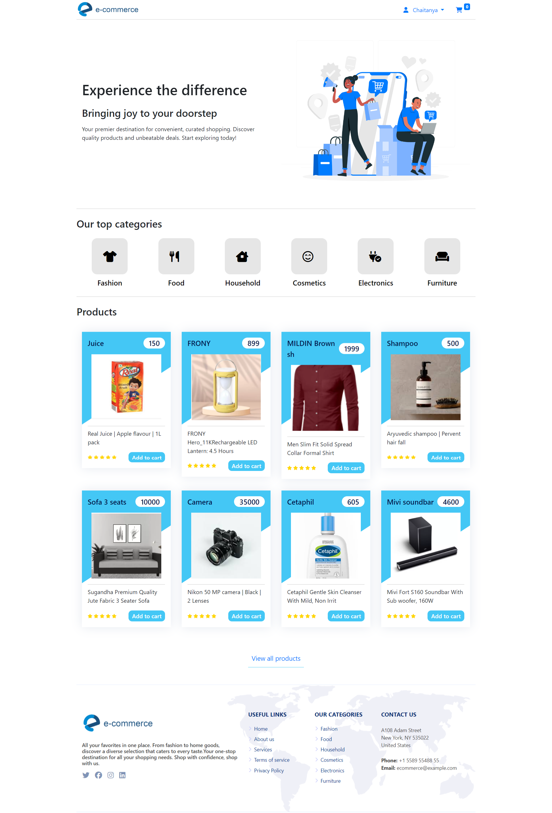

# E-Commerce Website

This is a simple e-commerce website built for learning purposes using PHP, HTML, CSS, and JavaScript.

## Features

- User authentication (register, login, logout)
- Seller authentication (register, login, logout)
- Product browsing
- Adding products to the cart
- Managing the shopping cart
- Checkout process
- Admin panel (for managing products, orders, etc.)

## Technologies Used

- PHP
- HTML
- CSS
- JavaScript

## Project Screenshots
- User Registration page

-User Login page

-User homepages

    
    

