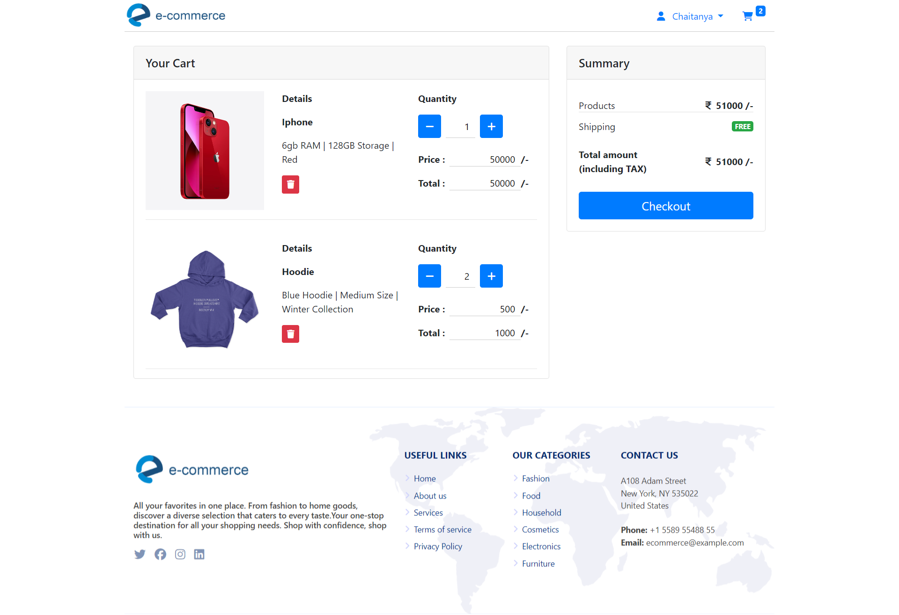

# E-Commerce Website

This is a simple e-commerce website built for learning purposes using PHP, HTML, CSS, and JavaScript.

## Features

- User authentication (register, login, logout)
- Seller authentication (register, login, logout)
- Product browsing
- Adding products to the cart
- Managing the shopping cart
- Checkout process
- Admin panel (for managing products, orders, etc.)

## Technologies Used

- PHP
- HTML
- CSS
- JavaScript
- Bootstrap
- Fontawesome

## Project Screenshots
## User
- **User Registration page**

- **User Login page**

- **User homepages**

    
    

- **User Cart Images**

    
    

- **User Orders Page**

## Admin
- **Admin Dashboard**

- **Admin Products**

- **Admin Orders**

